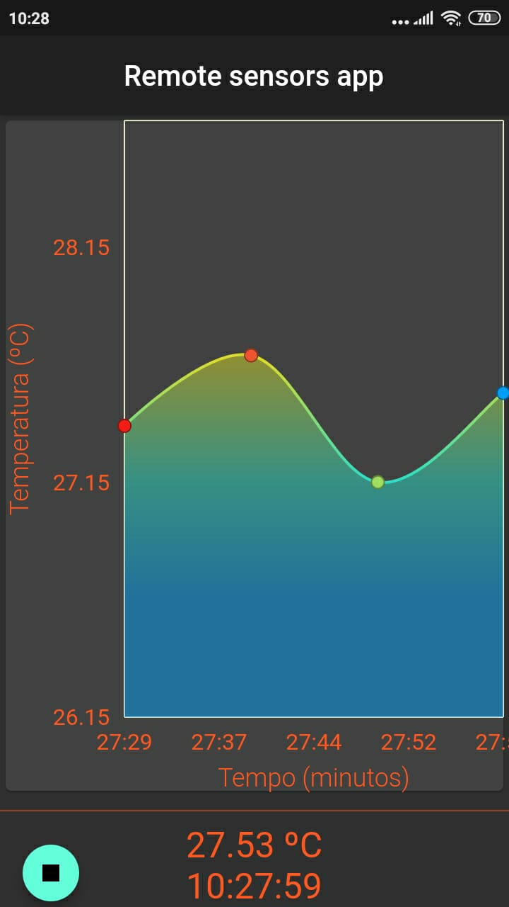

# Remote Sensor App

Aplicativo desenvolvido para plotar gráfico em “tempo real” das informações fornecidas pelos sensores controlados 
pelo microcontrolador Esp32. Para isso, utiliza uma API desenvolvida com Kotlin e Spring Boot hospedada no Heroku.

* [Esp32](https://github.com/DA0HN/remote-sensors-esp32)
* [API](https://github.com/DA0HN/remote-sensors-api)

# TODO

- [ ] Adicionar painel de configuração para gerenciar:
    - Tamanho da fila
    - Transmissão de dados entre API e Esp32
    - Transmissão entre App e API
    - Controlar tempo de consulta automática
- [ ] Menu de opções de mais sensores fornecidos pela API
- [ ] Adicionar tutorial básico do aplicativo com Stepper